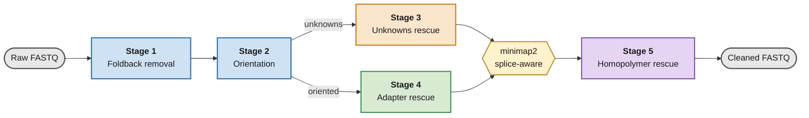
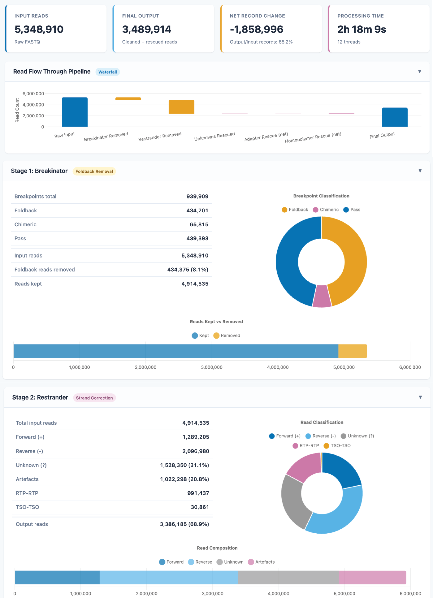

<p align="center">
  
</p>

<p align="center">
  <a href="https://pypi.org/project/directclean/"></a>
  <a href="https://pypi.org/project/directclean/"></a>
  <a href="LICENSE"></a>
  <a href="https://github.com/ylab-hi/DirectClean/issues"></a>
</p>

# DirectClean

Artifact-aware preprocessing and read rescue for Oxford Nanopore direct-cDNA sequencing.

DirectClean takes raw ONT direct-cDNA FASTQ and produces clean, 5′→3′ oriented reads for transcript quantification, isoform analysis, and fusion calling.

```bash
directclean -i raw_reads.fastq -r genome.fa -o results/ -t 8 -j gencode.v41.bed12
```

## Why DirectClean?

Direct-cDNA libraries carry artifact classes that primer-based preprocessing does not resolve:

- **Foldback inversions** — the sequenced strand folds back on itself.
- **Internal adapter concatemers** — two molecules joined at a TSO/RTP junction.
- **Homopolymer-mediated RT template switching** — reverse transcriptase detaches at an A/T-rich region and re-primes on an unrelated transcript. These read like genuine gene fusions at the alignment level.
- **Unclassified reads** — reads that cannot be oriented from their termini, but whose internal sequence is still recoverable.

The usual response is to discard the whole read. In PCR-free protocols every read is a unique molecule, so that is expensive. DirectClean instead **splits or trims at the artifact junction** and keeps the usable sequence.

[Pychopper](https://github.com/epi2me-labs/pychopper) handles orientation and terminal-primer-based rescue well. DirectClean keeps that logic and extends coverage to direct-cDNA-specific artifact classes:

| Capability | Pychopper | DirectClean |
| :--- | :--- | :--- |
| Strand orientation | Yes | Yes |
| Internal adapter handling | Terminal-primer based | Terminal trimming and supported concatemer splitting |
| Chimera rescue scope | Reads with valid terminal primers | Extends to unclassified reads |
| Foldback inversion removal | n/a | Yes |
| Homopolymer RT template-switching detection | n/a | Yes |

## Pipeline



| Stage | Tool / module | What it does |
| :--- | :--- | :--- |
| 1 | [Breakinator](https://github.com/jheinz27/breakinator) | Removes foldback inversion artifacts |
| 2 | [Restrander](https://github.com/mritchielab/restrander) | Orients reads 5′→3′, removes aberrant primer configurations, sets aside unorientable reads |
| 3 | Unknowns rescue | Recovers orientable sub-reads from the unknowns pool via internal adapter detection |
| 4 | Adapter rescue | Trims unsupported terminal residuals; splits supported internal concatemers |
| 5 | Homopolymer rescue | Detects A/T-rich RT template-switching junctions and splits chimeras |

A read is only split when the junction is supported by sequence evidence; fragments below the minimum length are dropped. Stage 5 requires both A/T density ≥ 85% and a consecutive A/T run ≥ 5 bp within a 10 bp window, so non-A/T junctions, including real fusions, pass through untouched.


## Performance

Read and base retention across four ONT direct-cDNA datasets:

| Dataset | Input records | Pychopper<br>records / bases | DirectClean<br>records / bases |
| :--- | ---: | ---: | ---: |
| A549 (SG-NEx) | 1,158,921 | 64.2% / 56.4% | **73.0% / 70.3%** |
| VCaP | 5,348,910 | 57.6% / 49.5% | **65.2% / 65.4%** |
| HCT116 (SG-NEx) | 6,952,609 | 65.9% / 58.0% | **73.5% / 73.3%** |
| HEYA8 (SG-NEx) | 10,799,478 | 51.4% / 42.8% | **71.1% / 69.6%** |

On VCaP, where the additional reads come from:

| | Pychopper | DirectClean |
| :--- | ---: | ---: |
| Adapter-derived segments rescued | 103,388 | 287,328 |
| Foldback inversions removed | n/a | 434,375 |
| Homopolymer chimeras resolved | n/a | 46,957 |
| Residual homopolymer junctions in output | 70,140 | 0 |
| Transcripts with read support | 27,851 | 29,343 |

Chimeric read rate on VCaP: 30.9% raw → 26.8% Pychopper → **16.9% DirectClean**.


## Installation

DirectClean is available through **Bioconda** and **PyPI**.

### Bioconda (recommended)

Bioconda installs DirectClean together with all required external tools.

```bash
mamba create -n directclean \
  -c conda-forge \
  -c bioconda \
  directclean

mamba activate directclean
directclean --help
````

### PyPI

DirectClean can also be installed from PyPI. Because the pipeline requires native command-line tools, install these dependencies first:

```bash
mamba create -n directclean-pip \
  -c conda-forge \
  -c bioconda \
  "python>=3.10,<4" \
  pip minimap2 samtools \
  "breakinator=1.1.1=*_2" \
  "restrander=1.1.3=*_1"

mamba activate directclean-pip
pip install directclean
directclean --help
```

For most users, the **Bioconda installation is recommended** because dependency management is handled automatically.


## Usage

DirectClean runs a splice-aware genome alignment internally. Allow ~24 GiB peak RAM; 32 GiB is recommended.

```bash
directclean \
  -i raw_reads.fastq \
  -r genome.fa \
  -o results/ \
  -t 8 \
  -j gencode.v41.bed12
```

| Flag | Default | Description |
| :--- | :--- | :--- |
| `-i`, `--input` | required | Raw ONT direct-cDNA FASTQ |
| `-r`, `--reference` | required | Reference genome FASTA |
| `-o`, `--output` | required | Output directory |
| `-t`, `--threads` | 4 | Threads for minimap2, samtools, Breakinator |
| `-j`, `--junc-bed` | none | Junction BED12 for guided alignment (GENCODE recommended) |

Detection thresholds and report options can be tuned as well, run `directclean --help` for the full list.

## Output

| File | Content |
| :--- | :--- |
| `directclean.cleaned.fastq` | Final artifact-resolved reads. Use this for downstream analysis; standard FASTQ, drop-in input for IsoQuant, FLAIR, FusionSeeker, or JAFFAL. |
| `directclean.report.html` | Interactive per-stage statistics and read flow |
| `directclean.homopolymer_report.tsv` | Per-read homopolymer junction calls |
| `directclean.rescued.fastq` | Stage 5 sub-reads only |
| `reports/directclean.rescue_report.tsv` | Per-read Stage 4 details |
| `intermediates/` | Per-stage FASTQ and the alignment BAM |

<p align="center">
  
</p>

## Citation

*To be updated on publication.* Please also cite the integrated tools:

- **Breakinator:** Heinz JM, Meyerson M, Li H. Detecting foldback artifacts in long reads. *BMC Genomics* (2026).
- **Restrander:** Schuster J, Ritchie ME, Gouil Q. Restrander: rapid orientation and artefact removal for long-read cDNA data. *NAR Genomics and Bioinformatics* 5(4):lqad108 (2023).

## Support

Bug reports and feature requests: [open an issue](https://github.com/ylab-hi/DirectClean/issues).

## License

MIT

## Contact

Qingxiang Guo — qingxiang.guo@northwestern.edu · [Rendong Yang Lab](https://github.com/ylab-hi)